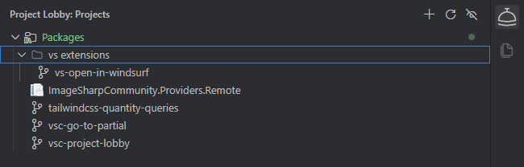
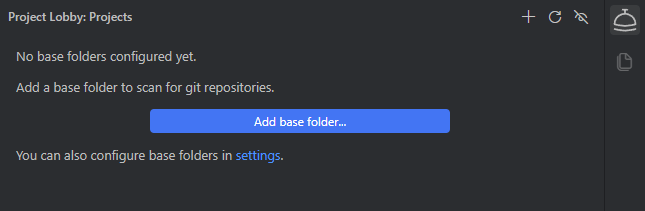
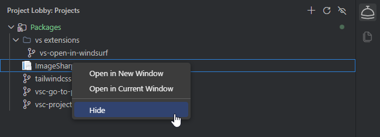

# Project Lobby

A VS Code extension that acts as a **start page for switching between projects**. It scans one or more configured base folders and shows every git repository it finds in a hierarchical tree in a dedicated Activity Bar view — so jumping from one project to another is a single click.

---

## Features

- **Hierarchical project tree** — repositories are grouped under their intermediate folders, mirroring your folder structure on disk
- **One-click switching** — open any repository in a new or the current window
- **Configurable open behavior** — set a default action; the alternative is always available from the right-click menu
- **Workspace file support** — if a repository contains a `.code-workspace` file, clicking it opens the workspace instead of the bare folder
- **Favicon icons** — if a repository contains a `favicon` (e.g. in `wwwroot`/`public`), it's used as the tree icon
- **Fast & cached** — scan results are cached between sessions so the tree shows instantly, then refreshes in the background
- **Configurable scanning** — control base folders, max depth, and folders to ignore

---

## Getting started

1. Open the **Project Lobby** view from the Activity Bar.
2. Click **Add base folder...** and pick a folder that contains your projects (e.g. `C:\Workspaces`).
3. All git repositories beneath it appear, grouped by their folders.
4. Click a repository to open it. Right-click for **Open in New Window** / **Open in Current Window**.

---

## Installation

### From the VS Code Marketplace

Search for **Project Lobby** in the VS Code Extensions panel, or install directly:

- [VS Code Marketplace](https://marketplace.visualstudio.com/items?itemName=skttl.vsc-project-lobby)
- [Open VSX Registry](https://open-vsx.org/extension/skttl/vsc-project-lobby)

### From a `.vsix` file

1. Download the latest `.vsix` from the [GitHub Releases](https://github.com/skttl/vsc-project-lobby/releases) page
2. In VS Code, open the Command Palette (`Ctrl+Shift+P`) → **Extensions: Install from VSIX...**
3. Select the downloaded file

---

## How scanning works

- Each base folder is walked recursively until a folder containing a `.git` directory is found — that folder is treated as a **repository leaf** and is not descended into further.
- If the repository root contains a `.code-workspace` file, opening it will open that workspace file instead of the folder.
- All intermediate folders are kept as **group nodes**, so the tree mirrors your disk layout.
- Descent is limited by `projectLobby.maxDepth` and skips any folder named in `projectLobby.ignoreFolders`.

<!-- SCREENSHOT: Tree with multiple levels of intermediate folder groups collapsed/expanded, showing a repository that uses a custom favicon icon and another that has a .code-workspace badge/indicator. Suggested filename: docs/images/tree-structure.png -->
<!--  -->

---

## Settings

See [docs/configuration.md](docs/configuration.md) for the full settings reference.

| Setting | Type | Default | Description |
|---|---|---|---|
| `projectLobby.baseFolders` | `string[]` | `[]` | Absolute paths scanned for git repositories |
| `projectLobby.maxDepth` | `number` | `4` | Max folder depth to descend below each base folder |
| `projectLobby.ignoreFolders` | `string[]` | `node_modules`, `.git`, `bin`, `obj`, `dist`, `.vs`, `.vscode` | Folder names to skip while scanning |
| `projectLobby.openBehavior` | `string` | `newWindow` | Default action when clicking a repository |
| `projectLobby.faviconWebRoots` | `string[]` | `wwwroot`, `public`, `static`, `assets`, `src/assets` | Subfolders searched for a favicon |
| `projectLobby.faviconMaxDepth` | `number` | `10` | Max depth to search inside a repository for a favicon |

---

## Contributing

See [docs/contributing.md](docs/contributing.md) for development setup, commit conventions, and the release process.

---

## License

MIT
